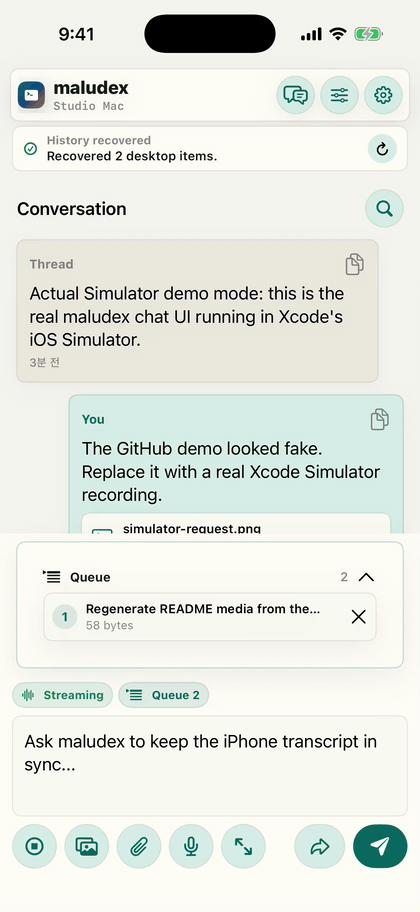
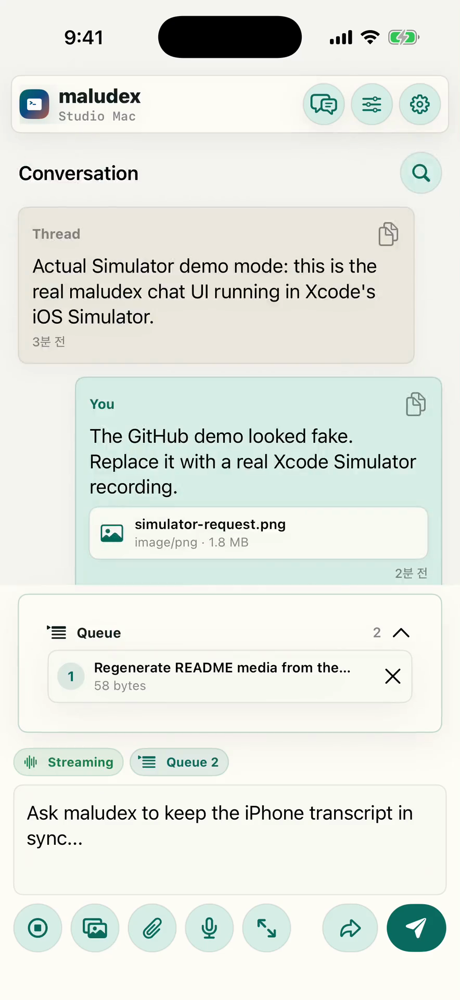
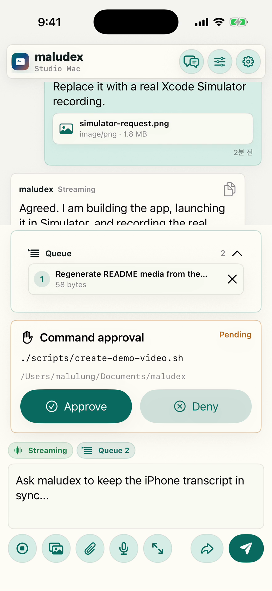
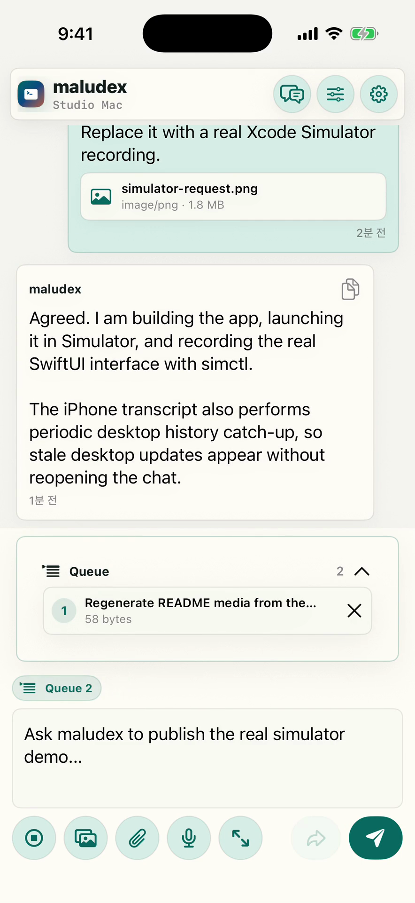
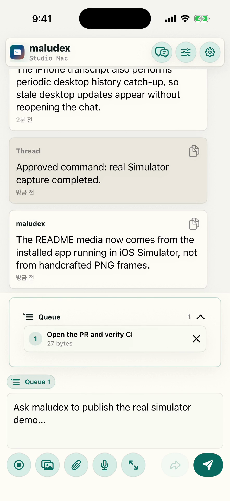

# maludex

[](https://github.com/malulungsoft/maludex/actions/workflows/ci.yml)
[](https://github.com/malulungsoft/maludex/releases)
[](LICENSE)
[](package.json)

Current version: `v0.7.3`

maludex is a local-first iPhone companion by malulung soft for driving Codex on one or more Macs from a polished mobile UI.

The Mac bridge launches `codex app-server` over stdio JSONL and exposes a narrow authenticated WebSocket API for the iPhone app. maludex does **not** expose `codex app-server --listen ws://0.0.0.0`, and v1 has no cloud relay.

## What You Can Do Now

- Pair an iPhone to one or more Macs with a QR capability token.
- Start, steer, stop, and queue Codex turns from iPhone.
- Pick projects, create projects, choose models, tune reasoning intelligence, and change permission mode.
- Stream transcripts with attachments, searchable history, collapsed long bubbles, tap-to-copy text, and approval cards.
- Keep per-bridge drafts, quick prompts, local transcripts, and mobile handoff history across app restarts.
- Use the macOS Control Center to repair stale bridge installs, rotate tokens, generate pairing QR codes, inspect diagnostics, and review iPhone-authored handoff prompts.

## Status

`v0.7.3` is a public preview for private localhost, LAN, Tailscale, or carefully controlled Nginx/TLS workflows. It is not hardened remote administration software and should not be exposed directly to the public internet.

## Demo

<p align="center">
  
</p>

The demo above is recorded from the actual SwiftUI app running in Xcode's iOS Simulator with `scripts/create-demo-video.sh`. It launches the installed app with local demo state and records the real maludex UI with `simctl`, not hand-rendered mock frames. [Watch the MP4 version](media/maludex-simulator-demo.mp4).

## Screenshots

| Real iPhone UI | Queue and attachments | Approval card |
| --- | --- | --- |
|  |  |  |

| Desktop sync | Completion | Composer |
| --- | --- | --- |
|  |  |  |

## Features

- SwiftUI iPhone client with QR pairing, camera scanner, connection status, searchable project/model pickers, project favorites, editable saved quick prompts, prompt composer, streaming transcript, approval cards, attachment picker, voice input, and local transcript persistence.
- SwiftUI macOS Control Center app for bridge health, recommended next steps, LaunchAgent repair, restart/start/stop, token rotation, pairing QR generation, and desktop review of iPhone-authored handoff prompts.
- Multiple saved Mac bridges, each with its own Keychain token and per-bridge session state.
- Node.js + TypeScript Mac bridge that translates between mobile WebSocket messages and Codex JSON-RPC over stdio JSONL.
- Project listing and project creation under configured roots.
- Desktop chat list and bounded history loading.
- Model, reasoning effort, permission mode, and context-compaction controls.
- Image and file attachments copied into the selected workspace before a turn.
- Subagent start, manual compact, approval response, and active-turn stop.
- Diagnostics dashboard with bridge health, Codex status, runtime counters, and token-free copyable reports.
- Reconnect-safe approval delivery: pending Codex approvals are replayed to the next authenticated iPhone connection instead of being declined immediately.
- CI and tag-driven GitHub Release automation for safer public releases.
- Integration tests with a mocked Codex app-server process.

## Security Warnings

- Use maludex only on networks you control: localhost, the iOS simulator, LAN you trust, or a private Tailscale IP.
- Do not router-port-forward the bridge to the public internet.
- If you put Nginx in front of maludex, keep the bridge bound to `127.0.0.1`, terminate TLS at Nginx, preserve the `Authorization` header, and add extra controls such as IP allowlisting, mTLS, or a private access layer. See [Nginx Reverse Proxy For Remote Access](docs/nginx-reverse-proxy.md).
- The bridge refuses wildcard WebSocket binds such as `0.0.0.0`; bind to `127.0.0.1`, `::1`, or one specific Tailscale IP.
- Every WebSocket upgrade must include the QR capability token as `Authorization: Bearer <token>`.
- The token is loaded from a `0600` file. By default the CLI creates `~/.codex-iphone-remote-bridge/token`.
- Do not commit token files, QR screenshots, pairing payload text, logs with prompt bodies, local attachments, or Xcode user state.
- The bridge defaults to `approvalPolicy: "on-request"` and `sandbox: "read-only"`.
- The mobile app can request only `read-only` or `workspace-write`; it does not expose `danger-full-access` or `approvalPolicy: "never"`.
- Prompt bodies are sent to Codex but are not logged by the bridge by default.
- The iPhone app persists the current prompt draft, saved quick prompts, and recent transcript locally per paired bridge so app restarts do not wipe work in progress. Those local app settings can contain prompt bodies; do not export device backups or diagnostics publicly.
- Queued mobile prompts are persisted locally so they can resume after a bridge restart. That queue file can contain prompt bodies and attachment references; keep it private, keep its `0600` permissions, and never commit or share it.
- iPhone-authored prompts are also copied into `~/.codex-iphone-remote-bridge/mobile-handoff.jsonl` with `0600` permissions so a desktop Codex session can explicitly recover what was sent from mobile. This is not a log stream, but it can contain prompt bodies; treat it as private and never commit or share it. The bridge keeps only the most recent 200 handoff entries by default; set `BRIDGE_MOBILE_HANDOFF_MAX_ENTRIES` or `--mobile-handoff-max-entries` to reduce or tune retention.
- Mobile attachments are copied into the selected workspace under `.codex-mobile-attachments/` with `0600` file permissions. Treat those files as local project data.
- A paired and unlocked iPhone should be treated as a trusted device. It can view recent transcript content and respond to approval requests.
- Approval requests are kept pending for mobile reconnects, but v1 has no APNs/cloud push relay. Background notifications are local iOS notifications and can only fire when the app is still able to receive or reconnect to the bridge before the approval timeout. If an approval card is already visible and you background the app, maludex re-schedules a local reminder for that pending approval.
- Plain `ws://` has no transport encryption by itself. Use localhost or Tailscale. Add TLS and stronger operational controls before considering any public endpoint.

## Requirements

- macOS with Codex installed and logged in.
- Node.js 20 or newer.
- npm.
- Xcode with iOS support for building the SwiftUI client.
- Tailscale on both the Mac and iPhone if you want to connect from outside your local Wi-Fi.

## Install The Bridge

```bash
git clone https://github.com/malulungsoft/maludex.git
cd maludex
./scripts/setup-local.sh
```

Run the bridge manually for local simulator testing:

```bash
npm run dev -- --host 127.0.0.1 --port 8765
```

Run it manually for a physical iPhone over Tailscale:

```bash
npm run dev -- --host <your-mac-tailscale-ip> --port 8765
```

The CLI prints a QR code unless `--no-qr` is passed. Scan that QR from the iPhone app. The QR contains the bearer capability token, so treat it like a password.

## Install As A macOS LaunchAgent

For a bridge that starts in the background on login:

```bash
./scripts/install-launch-agent.sh
```

That installs a LaunchAgent named `com.maludex.bridge`, creates the default token file if needed, verifies the TypeScript build, and starts the bridge on `127.0.0.1:8765`.

For a physical iPhone or off-Wi-Fi usage through Tailscale:

```bash
./scripts/configure-tailscale-bridge.sh
```

That script detects the Mac's Tailscale IPv4 address, updates the LaunchAgent to bind only to that one `100.x.y.z` address, restarts the bridge, and writes a pairing QR image to `/tmp/maludex-pairing.png`.

## macOS Control Center

Open the standalone Mac app package in Xcode:

```bash
open macos/MaludexControlCenter/Package.swift
```

Run the `MaludexControlCenter` scheme. The app reads the redacted doctor JSON from the local repo and can refresh bridge status, show the recommended next step, repair a stale LaunchAgent path, restart/start/stop the bridge, rotate the pairing token, and display a new pairing QR.

The app never displays the raw bearer token. Pairing QR images are still secrets because they encode the token.

To build a local `.app` bundle without opening Xcode:

```bash
npm run build:control-center
open "dist/maludex-control-center/maludex Control Center.app"
```

To install it into `/Applications` when writable, or `~/Applications`
otherwise:

```bash
npm run install:control-center
```

When launched from Finder or Xcode, macOS apps do not inherit the same shell
`PATH` as Terminal. The Control Center looks for `node` and `npm` in Homebrew,
Volta, asdf, mise, nvm, and common local-bin paths, then falls back to a small
managed shell bootstrap for nvm/asdf/mise. If your setup is unusual, set
`MALUDEX_NODE_PATH` and `MALUDEX_NPM_PATH` to absolute executable paths before
launching the app.

## Optional Nginx Remote Access

Tailscale remains the recommended private remote-access path. If you need a
domain-based endpoint, put Nginx in front of a loopback-only bridge and expose
`wss://your-domain` instead of exposing the bridge directly.

Read the full guide before using this on the internet:
[docs/nginx-reverse-proxy.md](docs/nginx-reverse-proxy.md).

## iPhone App

Open `ios/CodexRemoteBridge/CodexRemoteBridge.xcodeproj` in Xcode.

Before installing on your own iPhone:

1. Select the `CodexRemoteBridge` project in Xcode.
2. Open **Signing & Capabilities**.
3. Choose your Apple development team.
4. Change the bundle identifier if Xcode asks for a unique value.
5. Build and run on your device.

The installed display name is `maludex`.

## Pairing

The bridge emits a pairing URI in this shape:

```text
maludex://pair?host=100.x.y.z&port=8765&token=...&tls=0&name=Studio%20Mac
```

Pairing options in the app:

- Scan the QR code.
- Paste the pairing payload.
- Scan each additional Mac's QR to add it to the bridge switcher.

The iOS app stores each bridge token in Keychain. Non-token session state, such as the selected project, active thread, event id, and recent transcript, is stored locally on the device per bridge ID so histories do not bleed across saved Macs.

## Rotate A Pairing Token

If a QR code, pairing payload, or paired iPhone may be exposed, rotate the Mac
bridge token and pair again:

```bash
npm run rotate-token -- --host <host-for-iphone> --port 8765 --name "Studio Mac"
```

For an Nginx/TLS endpoint:

```bash
npm run rotate-token -- --host maludex.example.com --port 443 --tls --name "Studio Mac" --qr-file /tmp/maludex-pairing.png
```

You can also generate a TLS pairing QR without rotating the token:

```bash
npm run doctor -- --pairing-qr --host maludex.example.com --port 443 --tls --qr-file /tmp/maludex-pairing.png
```

The command replaces the token file with a new `0600` high-entropy token and
prints or writes a new QR without printing the raw token. A running bridge
detects the token file change and disconnects the currently paired iPhone; old
QR codes stop working. In the iPhone app, use `Forget` on the old bridge entry
and scan the new QR.

## Diagnostics

Open the project screen controls and tap **Diagnostics** to inspect bridge
health from the iPhone. The dashboard shows app/bridge versions, endpoint,
Codex process status, token-file validity, active turns, pending approvals,
event replay counters, project root count, and uptime.

Use **Copy report** when filing an issue. The report intentionally excludes
bearer tokens, prompt bodies, transcript text, command bodies, and attachment
contents.

Common recovery paths:

- `Cannot connect`: confirm the bridge is running and the iPhone can reach the Tailscale or Nginx address.
- `Authentication failed`: forget the saved bridge and scan a fresh QR after token rotation.
- `Codex not running`: confirm Codex is installed and logged in on the Mac.

## Desktop Handoff

maludex saves iPhone-authored prompts to a private handoff inbox so the desktop
Codex session can explicitly recover mobile instructions that were sent through
the bridge but not live-injected into an already open desktop conversation.

The macOS Control Center shows a **Mobile Handoff** panel with the latest
iPhone-authored requests, prompt previews, metadata, and attachment counts. You
can expand a handoff card and copy the full prompt for recovery. This panel reads
the same private inbox file and can display prompt bodies, so do not share
screenshots or copied output publicly.

```bash
npm run handoff -- --limit 10
```

This command prints prompt bodies from
`~/.codex-iphone-remote-bridge/mobile-handoff.jsonl`. Use it only on your own
Mac and avoid pasting the output into public issues, logs, or screenshots.
Set `BRIDGE_MOBILE_HANDOFF_MAX_ENTRIES=50` before installing or starting the
bridge if you want the inbox to retain fewer prompt bodies.

## Multiple Macs

Install and run the bridge on every Mac you want to control. Each Mac must have its own token file and QR pairing payload.

On the iPhone:

1. Pair the first Mac.
2. Pair the second Mac by scanning its QR.
3. Use the bridge switcher in the project screen to move between saved Macs.

Switching bridges closes the current WebSocket, restores that Mac's saved local session snapshot, and reconnects with that Mac's own bearer token.

## Project Layout

- `bridge/src`: Node.js TypeScript bridge.
- `bridge/test`: integration test with a mock Codex app-server JSON-RPC process.
- `ios/CodexRemoteBridge`: SwiftUI iOS app.
- `docs/architecture.md`: component and protocol design.
- `docs/threat-model.md`: preview threat model and residual risks.
- `docs/nginx-reverse-proxy.md`: optional TLS reverse-proxy setup for remote access.
- `scripts/setup-local.sh`: local dependency and build setup.
- `scripts/install-launch-agent.sh`: macOS LaunchAgent installer.
- `scripts/build-control-center-app.sh`: builds or installs the macOS Control Center `.app` bundle.
- `scripts/configure-tailscale-bridge.sh`: private external access setup through Tailscale.
- `scripts/create-demo-video.sh`: builds the iOS app, launches it in Xcode's iOS Simulator, records the real UI with `simctl`, and rebuilds README screenshots, GIF, and MP4.

## Development

```bash
npm install
npm run build
npm test
```

## Upgrade

```bash
git pull --ff-only
npm ci
npm run build
launchctl kickstart -k "gui/$(id -u)/com.maludex.bridge"
```

Rebuild the iPhone app from Xcode after pulling iOS changes.

## Release

Release checks and GitHub tag publishing are documented in
[docs/release.md](docs/release.md).

To rebuild the README screenshots, GIF, and MP4 from the real iOS Simulator UI:

```bash
./scripts/create-demo-video.sh
```

Set `MALUDEX_DEMO_DEVICE` to choose a different installed Simulator device, for example `MALUDEX_DEMO_DEVICE="iPhone 17 Pro Max" ./scripts/create-demo-video.sh`.

Swift model tests can be compiled and run without opening Xcode:

```bash
swiftc -parse-as-library \
  ios/CodexRemoteBridge/Sources/CodexRemoteBridge/JSONValue.swift \
  ios/CodexRemoteBridge/Sources/CodexRemoteBridge/TranscriptStore.swift \
  ios/CodexRemoteBridge/Sources/CodexRemoteBridge/ClientModels.swift \
  ios/CodexRemoteBridge/Sources/CodexRemoteBridge/Pairing.swift \
  ios/CodexRemoteBridge/Sources/CodexRemoteBridge/DeviceStateStore.swift \
  ios/CodexRemoteBridge/Tests/ClientModelsTests.swift \
  -o /tmp/maludex-client-models-tests
/tmp/maludex-client-models-tests

swiftc -parse-as-library \
  ios/CodexRemoteBridge/Sources/CodexRemoteBridge/JSONValue.swift \
  ios/CodexRemoteBridge/Sources/CodexRemoteBridge/ClientModels.swift \
  ios/CodexRemoteBridge/Sources/CodexRemoteBridge/TranscriptStore.swift \
  ios/CodexRemoteBridge/Tests/TranscriptStoreTests.swift \
  -o /tmp/maludex-transcript-store-tests
/tmp/maludex-transcript-store-tests
```

## Runtime Data That Must Stay Local

Do not commit:

- `~/.codex-iphone-remote-bridge/token`
- `~/.codex-iphone-remote-bridge/prompt-queue.json`
- `~/.codex-iphone-remote-bridge/mobile-handoff.jsonl`
- QR images or copied pairing payloads
- `.codex-mobile-attachments/`
- Xcode `xcuserdata/` and `*.xcuserstate`
- logs containing prompt bodies or private paths
- generated app archives that may include signing metadata

## License

maludex is open source under the [Apache License 2.0](LICENSE).
