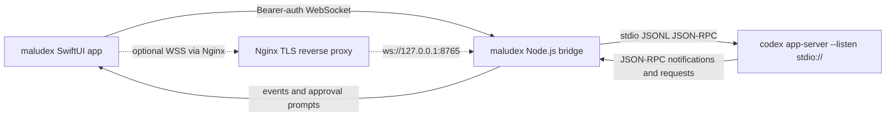

# maludex Architecture

## Goals

maludex lets an iPhone send prompts to Codex running on a nearby or Tailscale-reachable Mac without exposing the Codex app-server WebSocket listener. The maludex bridge owns the only Codex process and talks to it over stdio JSONL.

## Components



## maludex Bridge

The maludex bridge is a Node.js + TypeScript process in `bridge/src`.

- Launches Codex with `codex app-server --listen stdio://`.
- Reads and writes newline-delimited JSON-RPC objects on the child process stdio streams.
- Hosts an authenticated WebSocket for the iPhone.
- Refuses wildcard binds and defaults to `127.0.0.1:8765`; external device access should bind to one Mac Tailscale `100.x.y.z` address, or stay on loopback behind a TLS reverse proxy such as Nginx.
- Loads the bearer capability token from a `0600` file.
- Creates a default `~/.codex-iphone-remote-bridge/token` file with `0600` permissions if the CLI is started without `--token-file`.
- Prints a QR code containing `maludex://pair?host=...&port=...&token=...&tls=0&name=...`; the iOS parser still accepts the older `codex-remote://pair` payload for existing QR screenshots.
- Requires mobile clients to send the token as `Authorization: Bearer <token>`.
- Adds a monotonic `eventId` to server-originated Codex events and approval prompts.
- Buffers recent events and replays events greater than `afterEventId` on reconnect.
- Queues outbound WebSocket frames under backpressure and closes clients that exceed the queue cap.
- Lists candidate projects from configured roots and recent Codex thread working directories.
- Creates new project directories only under configured roots.
- Lists and resumes existing Codex desktop/app-server threads for mobile history browsing.
- Applies mobile-selected model intelligence, bounded sandbox, approval, and auto-compaction settings to thread/resume/turn requests.
- Reports token-free runtime diagnostics through `bridge.status`, including bridge version, Codex process state, token-file validity, event buffer counters, active turns, pending approvals, project root count, and uptime.
- Starts manual compaction with `thread/compact/start`.
- Starts subagents by forking the active thread with `thread/fork`, then sending a scoped `turn/start` to the forked thread.
- Converts resumed thread turns into a narrow mobile transcript format, strips raw `turns` from mobile thread payloads, and truncates very large histories to a bounded recent window.
- Extracts `localImage` inputs and mobile attachment file lines into transcript attachment metadata. Small local images are included as base64 previews for iOS rendering; large images and documents render as metadata cards.
- After an iPhone-authored turn completes, the bridge checks recent Codex turns; if the mobile user message is missing, it appends a user `message` item with `thread/inject_items` so reopened desktop history can retain the prompt.
- In parallel, the bridge writes iPhone-authored `turn.start`, `turn.steer`, and `subagent.start` prompts to a private `0600` desktop handoff inbox at `~/.codex-iphone-remote-bridge/mobile-handoff.jsonl`. This intentionally stores prompt bodies outside bridge logs so a desktop Codex session can explicitly recover mobile instructions that cannot be live-injected into an already open desktop conversation. The inbox is pruned to the most recent 200 entries by default.
- The iOS client persists each paired bridge token in Keychain and keeps the last bridge plus per-bridge project, model, intelligence level, permission mode, compaction setting, thread id, replay event id, and recent transcript in local device preferences keyed by bridge ID.
- Copies mobile attachments into the selected workspace under `.codex-mobile-attachments/` before starting a turn.
- Logs metadata such as message type, Codex method, ids, prompt byte length, and connection state. It does not log prompt bodies.

`scripts/configure-tailscale-bridge.sh` is the supported helper for private external access. It detects the Mac's Tailscale IPv4 address, updates the LaunchAgent host argument to that single address, restarts the bridge, checks the TCP listener, and writes a pairing QR image outside the repo.

For domain-based remote access, Nginx can terminate TLS and proxy WebSocket
upgrades to a loopback-only bridge. The bridge still enforces the bearer token
and must not be exposed directly. See `docs/nginx-reverse-proxy.md`.

## Codex JSON-RPC

The bridge follows the installed `codex app-server generate-ts` protocol surface. The MVP uses:

- `initialize`, then `initialized`
- `thread/start`
- `thread/list`
- `thread/resume`
- `thread/fork`
- `thread/compact/start`
- `turn/start`
- `turn/interrupt`
- `model/list`
- server notifications such as `thread/started`, `turn/started`, `item/agentMessage/delta`, `turn/completed`
- server requests such as `item/commandExecution/requestApproval`, `item/fileChange/requestApproval`, `item/permissions/requestApproval`, `execCommandApproval`, and `applyPatchApproval`

JSON-RPC messages are sent as JSONL, one object per line. The bridge does not add a WebSocket listener to Codex itself.

## Mobile WebSocket Protocol

Client to bridge:

```json
{ "id": "ios-1", "type": "thread.start", "cwd": "/Users/me/project" }
{ "id": "ios-p", "type": "project.list" }
{ "id": "ios-n", "type": "project.create", "root": "/Users/me/Documents", "name": "New App" }
{ "id": "ios-m", "type": "model.list" }
{ "id": "ios-c", "type": "chat.list" }
{ "id": "ios-o", "type": "chat.open", "threadId": "thread-id", "model": "gpt-5.5", "transcriptLimit": 120 }
{ "id": "ios-s", "type": "bridge.status" }
{ "id": "ios-2", "type": "turn.start", "threadId": "thread-id", "prompt": "...", "model": "gpt-5.5", "reasoningEffort": "high", "sandbox": "workspace-write" }
{ "id": "ios-k", "type": "thread.compact", "threadId": "thread-id" }
{ "id": "ios-a", "type": "subagent.start", "threadId": "thread-id", "role": "worker", "prompt": "Investigate the failing test." }
{ "id": "ios-3", "type": "approval.respond", "approvalId": "approval-1", "decision": "accept" }
{ "id": "ios-4", "type": "turn.stop", "threadId": "thread-id" }
```

`turn.start` may include up to five attachments:

```json
{
  "id": "ios-2",
  "type": "turn.start",
  "threadId": "thread-id",
  "prompt": "이 이미지와 파일을 확인해줘.",
  "attachments": [
    { "kind": "image", "filename": "screen.png", "mimeType": "image/png", "dataBase64": "..." },
    { "kind": "file", "filename": "notes.txt", "mimeType": "text/plain", "dataBase64": "..." }
  ]
}
```

Images are saved and forwarded to Codex as `localImage` inputs. Non-image files are saved in the workspace and included in the text input as local file paths so Codex can inspect them with normal tools.

Bridge to client:

```json
{ "type": "bridge.ready", "protocolVersion": 1, "serverTime": "...", "lastEventId": 7 }
{ "id": "ios-s", "type": "response", "ok": true, "result": { "bridgeVersion": "0.4.3", "codexRunning": true, "tokenFileValid": true } }
{ "id": "ios-1", "type": "response", "ok": true, "result": {} }
{ "id": "ios-c", "type": "response", "ok": true, "result": { "chats": [] } }
{ "id": "ios-o", "type": "response", "ok": true, "result": { "thread": {}, "transcript": [], "transcriptTruncation": { "truncated": false } } }
{ "type": "codex.event", "eventId": 8, "method": "item/agentMessage/delta", "params": {} }
{ "type": "approval.requested", "eventId": 9, "approvalId": "approval-1", "method": "item/commandExecution/requestApproval", "params": {} }
```

The mobile protocol is intentionally narrow. It does not expose arbitrary Codex JSON-RPC calls in v1.

The iOS app can store multiple pairing payloads. Switching bridges closes the current WebSocket, restores that bridge's local session snapshot, and reconnects with that bridge's own bearer token.

For reconnects, clients may include `?afterEventId=<last-seen-id>` in the WebSocket URL or send a `Last-Event-ID` header. The bridge replays buffered events with a larger `eventId` and marks them with `replayed: true`.

## Approval Handling

Codex approval requests are forwarded to the authenticated mobile client with their original method and params. The bridge stores the Codex request id until the iPhone responds.

Decision mapping:

- modern command and file approvals: `accept`, `acceptForSession`, `decline`, `cancel`
- legacy exec/apply-patch approvals: mapped to `approved`, `approved_for_session`, `denied`, `abort`
- permissions approvals: only requested permissions supplied by the mobile client are granted; otherwise the bridge returns an empty permission grant for the current turn

If the phone disconnects while approvals are pending, the bridge keeps them pending for replay to the next authenticated connection. Pending approvals time out after 10 minutes by default, and on bridge shutdown they are declined.

## Defaults

Thread creation defaults:

```json
{
  "approvalPolicy": "on-request",
  "approvalsReviewer": "user",
  "sandbox": "read-only",
  "experimentalRawEvents": false,
  "persistExtendedHistory": true
}
```

Turn sending also sets `approvalPolicy: "on-request"` and `approvalsReviewer: "user"`.

The bridge accepts only `read-only` and `workspace-write` from mobile clients, and only `untrusted`, `on-failure`, and `on-request` approval policies. It never defaults to `danger-full-access` and does not expose `approvalPolicy: "never"`.
