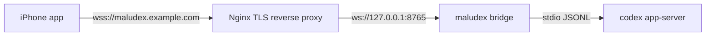

# Nginx Reverse Proxy For Remote Access

maludex can run behind Nginx, but the bridge itself should still bind only to
loopback. Nginx owns the public HTTPS/WSS endpoint, TLS certificates, and any
extra network controls.

This is more exposed than the Tailscale setup. Use it only when you understand
the operational risk of putting an authenticated remote-control endpoint on the
internet.

## Recommended Shape



Security properties:

- `codex app-server` is still stdio-only.
- `maludex` still requires `Authorization: Bearer <token>` on every WebSocket
  upgrade.
- The token still lives in a `0600` file.
- The bridge still refuses `0.0.0.0` and `::`, and `maludex doctor` flags LaunchAgents that try to use those wildcard hosts.
- Nginx adds TLS in front of the local bridge.

## Run The Bridge On Loopback

```bash
npm run dev -- --host 127.0.0.1 --port 8765 --no-qr
```

For LaunchAgent usage, install the bridge normally and keep the host as
`127.0.0.1`.

```bash
./scripts/install-launch-agent.sh
```

## Minimal Nginx Server Block

Replace `maludex.example.com` with your domain and update certificate paths for
your certificate manager.

```nginx
map $http_upgrade $connection_upgrade {
    default upgrade;
    '' close;
}

server {
    listen 443 ssl http2;
    server_name maludex.example.com;

    ssl_certificate /etc/letsencrypt/live/maludex.example.com/fullchain.pem;
    ssl_certificate_key /etc/letsencrypt/live/maludex.example.com/privkey.pem;

    # Strongly recommended: add an IP allowlist, mTLS, or another access layer.
    # allow 203.0.113.10;
    # deny all;

    location / {
        proxy_pass http://127.0.0.1:8765;
        proxy_http_version 1.1;
        proxy_set_header Upgrade $http_upgrade;
        proxy_set_header Connection $connection_upgrade;
        proxy_set_header Host $host;

        # Preserve the mobile bearer token for the bridge.
        proxy_set_header Authorization $http_authorization;

        proxy_read_timeout 3600s;
        proxy_send_timeout 3600s;
        proxy_buffering off;
    }
}
```

Optional HTTP-to-HTTPS redirect:

```nginx
server {
    listen 80;
    server_name maludex.example.com;
    return 301 https://$host$request_uri;
}
```

## Pairing URI

When Nginx terminates TLS on port `443`, pair the iPhone with `tls=1`:

```text
maludex://pair?host=maludex.example.com&port=443&token=<token>&tls=1&name=Studio%20Mac
```

The token is the content of the local token file:

```bash
cat ~/.codex-iphone-remote-bridge/token
```

Do not paste that token into GitHub issues, chat logs, screenshots, or README
examples.

## Extra Hardening Checklist

- Use a dedicated subdomain for maludex.
- Keep the bridge bound to `127.0.0.1`.
- Keep the token file at permission `0600`.
- Rotate the token if a QR image or pairing URI was shown publicly.
- Add an IP allowlist when your mobile carrier/VPN path allows it.
- Prefer mTLS or an authenticated private access layer for regular use.
- Keep `approvalPolicy` on `on-request` and sandbox on `read-only` by default.
- Monitor Nginx access logs for unknown clients, but do not log request bodies.

## What Nginx Does Not Solve

Nginx does not make a stolen bearer token safe. Anyone who has the token and can
reach the Nginx endpoint can connect as the paired phone. Nginx also does not
change the trust model of approvals: approving a command from the phone still
authorizes work on the Mac.
